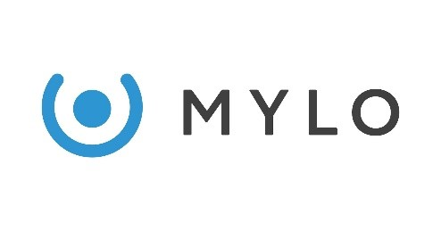
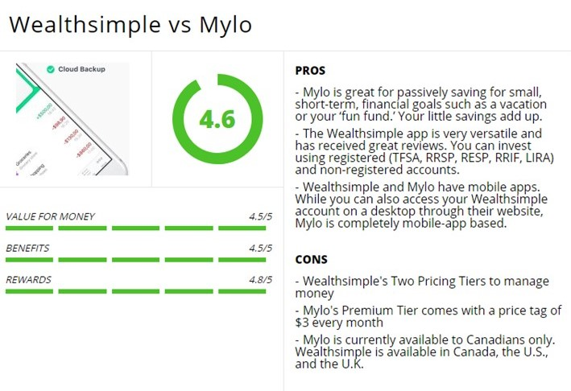

# Unit 1 Homework Assignment: FinTech Case Study

## Overview and Origin

### **Name of company**

   **Mylo Financial Technologies**

  Investment Management | Montreal, QC | www.mylo.ai

 
### **When was the company incorporated?**

  **The company was incorporated in 2015**

### **Who are the founders of the company?**

  **Philip Barrar, Founder and CEO**

### **How did the idea for the company (or project) come about?**

  Mylo is a Canadian FinTech company that is in the personal finance space. The purpose of the company is to help Canadians manage their financial goals in a stress free manner. 

  Canadians need help saving. Data from the Organisation for Economic Cooperation and Development (OECD) found that Canadians rank in the bottom half of 29 countries for saving. In fact, Canadians were forecasted to save just 3.09% of their disposable income in 2019. The savings rate is predicted to increase, with a forecasted rate of 3.21% for 2020. Given the average disposable income is around CAD$39,777, this means Canadians will be saving roughly CAD$1,277 this year.

  Canadian millennials particularly need help. Over half of Canadian millennials have less than $1,000 in savings, regardless of their income. The founders of Mylo which stands for Managing Your Left Overs are working to fix that with a simple, automatic and stress-free solution for saving money and building wealth.

  The Mylo app starts with rounding up every purchase you make to the nearest dollar, their automated savings app launched in July 2017 has already been downloaded by over 750,000 Canadians from coast to coast. 

### **How is the company funded? How much funding have they received?**

Mylo raised $3.3M from three seed funding rounds.

In 2015, they received $500 000 from **Ferst Capital Partners**. 

In 2017 Mylo received an additional $750 000 from **Ferst Capital Partners**. 

In 2018, Mylo got a combined $2.5 million from **Ferst Capital Partners**, **Desjardins Venture Capital** and **Robert Raich**.

Mylo's latest funding round was a Series A for $10M on Nov 2019. National Bank’s corporate venture capital arm, **NAventures**, led the round, while **Desjardins Capital**, **Ferst Capital Partners**, and **Tactico** made follow-on investments. This Series A brings Mylo’s total funding-to-date to about **$14 million**. 

## Business Activities:

### **What specific financial problem is the company or project trying to solve?**

  Affordability and financial stability have become a major issue in Canada. According to the annual [BDO Canada Affordability Index](https://debtsolutions.bdo.ca/our-people/bdo-in-the-news/bdo-canada-affordability-index-2019/), Canadians are feeling financially stuck and struggling to make ends meet due to rising costs of living, stagnant incomes and growing debt loads. 

  The index, which examines how affordable life is in Canada, shows that over half (53%) of Canadians are living paycheque to paycheque and one in four (25%) say their debt load is overwhelming. More than one-quarter (27%) don’t have enough for their daily needs. 

  Mylo is a financial mobile application that helps you save and invest your spare change on purchases. Simplifying the savings and investing process is what automated savings apps like Mylo aim to accomplish. There is no drastic change to your daily lifestyle, and you do not need to understand the nitty-gritty details of portfolio management.

### **Who is the company's intended customer?  Is there any information about the market size of this set of customers?**

  Mylo is targeting millennials (born between 1980 -1996). Millennials, now the largest generation of Canadians, at 27% of the total population, are facing different challenges in building wealth than previous generations of young Canadians. Despite being the most educated generation, concerns have been raised that millennials have been “slower to launch”.  Millennials entered adulthood at a time of historically low interest rates, soaring house prices, stiff tuition cost increases and a job market where temporary work without benefits or pensions is common. 

  Millennials are also the first generation to have grown up with the Internet and digital technology. As such, they are considered the first generation of “digital natives.” 
    
  Automated savings and investing along with lower investment fees are the rave among millennials who do not mind taking ownership of their investment portfolios.

### **What solution does this company offer that their competitors do not or cannot offer? (What is the unfair advantage they utilize?)**

The major benefit of Mylo is the fact that not only does it save your spare change but also invests in low cost ETFs to save on investment fees. Mylo is like a bridge between expensive professional wealth management and DIY where not many people are confident to solely manage their portfolios. 

Mylo leverages technology to target two lines of business:

1.**Investments** – Mylo leverages technology to deliver low-cost investment to customers. With simple online sign up instead of physical branches and investments in low fee financial products such as ETFs, Mylo can provide investment services which are cheaper and easier than traditional financial managers. By rounding up purchases Mylo ensures that they have a consistent increase of assets under management.

2.**Recommendations** – Mylo tracks customer purchases and uses demographics, internet search activity and location data in order to provide recommendations for financial products (e.g. insurance or mortgage rates) to customers when a customer is likely going to make a financial decision in the near future. Commissions are earned by Mylo for recommending these third-party products to customers.

  **Products and Pricing**

  1. Mylo: Mylo rounds up a customer’s credit and/or debit card purchases and then invests that money. Mylo costs $1 per month.

  2. Mylo Advantage: Mylo Advantage gives you all the perks of a regular Mylo account, plus some extra perks. It is a premium service which allows for investing in registered accounts (TFSA,RRSP), next day withdrawal, brand rewards and socially responsible investment portfolios. The price for Mylo Advantage is $3 per month.
  
  **Key Features of Mylo App**:

  1.	Save & Invest in autopilot - Automatic roundups, multipliers, recurring deposits and one-time boosts make reaching your goals effortless
  2.	Fully-managed, diversified portfolio - A portfolio manager uses Modern Portfolio Theory to invest in low-cost, exchange-traded funds (ETFs)
  3. Unlimited Tax-free accounts - Invest with a TFSA or RRSP to benefit from valuable tax savings
  4. Free, next-day withdrawals – Access your money when you really need it with faster withdrawals 
  5. Socially responsible investing – Choose the Mylo SRI Fund to make a positive impact with investments
  6. Cashback Perks – Get exclusive deals and discounts from brands you love

  **How the app works**:

  1.	Create a Mylo account and link your bank to the app. Mylo needs a funding source to start rounding up your purchases. Your investment account is funded by the bank account that you designate as your funding source, typically a chequing account. Don’t worry about overdrafts.  Mylo only works if the account has at least $25.00 in it. 
  2.	Once your Mylo account is connected, link your credit and debit cards and start spending as usual.
  3.	Mylo will round your purchases up to the nearest dollar and invest the spare change. So, if you spend $3.25 on coffee, the app will take an extra $0.75 and deposit it into your Mylo account. Every week on Monday, the app adds up all your roundups from the previous week, withdraws the total from your funding source, and invests the money in your investment account. 
  4.	If you activate the in-app multiplier, you can accelerate your savings by multiplying your roundups by 2X to 10X.
  5.	Mylo is a goal-based saving and investing platform. Having a goal will motivate you to save, and it also gives your portfolio manager some important information about how they should invest your money, including what kind of account makes the most sense for you and what investment strategy they should use.

   
### **Which technologies are they currently using, and how are they implementing them?**

  Mylo uses machine learning in conjunction with financial and transactional data to make personalized recommendations that help users make smart decisions with their money.

  Mylo leverages data, algorithms and AI to provide users appropriate and optimized financial management insights, recommendations and solutions through a 3rd party API enabled in-app integration.

  Mylo uses SSL connections and 256-bit encryption in order to keep customers’ information secure.
    
## Landscape:

### **What domain of the financial industry is the company in?**

  Personal Finance/Investment Tech/Micro-investing 

### **What have been the major trends and innovations of this domain over the last 5-10 years?**

**Fintech Market in Canada**

The market's largest segment is Digital Payments with a total transaction value of C$68,705m in 2020. Roughly a quarter of the fintechs in Canada provide money transfer and payment services.

Due to the major differences in the KPIs of FinTech products, e.g. different nature of loan origination volume in Alternative Lending in comparison to Assets under Management in Robo-Advisors, no total transaction value for all segments can be calculated.

Main Classification of Products are:

1. Digital Payments
2. Personal Finance
3. Alternative Lending
4. Alternative Financing

The second-largest category is saving and investment services, with 14% of the market. The sector of personal finance, wealth management and robo-advisory is seeing record funding. 

[Personal Finance Landscape in Canada](https://www.statista.com/outlook/298/108/personal-finance/canada?currency=cad)
:

  •	Total transaction value in the Personal Finance segment amounts to C$13,254m in 2020.

  •	Total transaction value is expected to show an annual growth rate (CAGR 2020-2024) of 24.7% resulting in the total amount of C$32,068m by 2024.

  •	The market's largest segment is Robo-Advisors with a total transaction value of C$11,470m in 2020.

  **Mylo Technologies merges the Robo-advisor with an automated saving tool.**

### **What are the other major companies in this domain?**

  Robo advisors are investing platforms that use a computer algorithm to design and manage your investment portfolio. Companies in this domain are getting more sophisticated in their offerings. Some robos now offer chequing accounts, others let you pick stocks or buy insurance or offer real-life financial advice. You can invest in all kinds of accounts too, including Tax-Free Savings Accounts (TFSAs), Registered Retirement Savings Plan (RRSPs), Registered Retirement Income Fund (RRIFs), Registered Education Savings Plans (RESPs) and more. 
 
  Some of the leading Robo Advisors in Canada for 2020 are:
  1.	Wealthsimple
  2.	BMO Smartfolio
  3.	Questwealth Portfolios
  4.	Nest Wealth
  5.	WealthBar
  6.	Justwealth

## Results

### **What has been the business impact of this company so far?**

  Mylo savings app launched in July 2017. Today, Mylo has already been downloaded by over 750,000 Canadians from coast to coast. Mylo was part of [“Canada’s Top 50 FinTech Companies”](http://www.digitalfinanceinstitute.org/?post_documents=canadas-top-50-fintech-companies) for 2019.

  Mylo is a privately held company. The estimated annual revenue for Mylo is about [$3.1M](https://www.owler.com/company/mylofinancialtechnologies).

### **What are some of the core metrics that companies in this domain use to measure success? How is your company performing, based on these metrics?**

  **Factors that distinguish competitors in the market:**

  - User friendly products
  - Account Minimums
  - Investment options
  - Management fees
  - Referral Program
  - Customer Support

  **Mylo's performance review**

  **PROS**

  - Automatically save money – Whether it's by roundups or recurring deposits, Mylo makes it easy to save money on autopilot. You won't even notice the money leave your account.

  - Hands-off investing – For new investors, this is a great way to get into investing. Once you understand a bit how it works and it's potential, you can try investing on your own.

  - It's cheap – For only $12/year ($1/month) you're getting a lot of sweet features from Mylo.

  - Great customer service – Monday through Friday you can chat with a Mylo representative easily within the app. 

  **CONS**

  - Only available in Canada – Mylo is currently available in Canada 

  - Registered accounts cost extra – In order to open a TFSA or RRSP with Mylo, you need to be a Mylo Advantage member which costs a couple of bucks more per month.

  - Make it easier to track portfolio performance – Mylo sends an account statement each month which is extremely helpful, but it's not very beginner-friendly. For an app that's aimed at beginner investors, you'd think they'd have an easier way to track portfolio performance.

  - Flat fee vs % of assets fee - Flat fees are rare among robo-advisors, which typically charge a percentage of assets under management. A $1 or $3 a month fee sounds cheap, but can be a high percentage of assets for investors with small balances. If you make only roundup contributions, you could hover in that zone for quite a while.
  

### **How is your company performing relative to competitors in the same domain?**

  **Top 3 competitors of Mylo:**

  

   Wealthsimple is Canada’s largest robo-advisor. Wealthsimple is more of a wealth management company which also offers a roundup bonus feature that works just like Mylo. The company was launched in Canada in 2014 and has since expanded its operations to the United States and the United Kingdom. Wealthsimple is backed by several financial giants, including the Power Financial Group which manages $1.4 trillion in assets under management. 

   

   [*Source: Personal Finance Freedom*](https://www.personalfinancefreedom.com/wealthsimple-vs-mylo-which-is-better-and-why-top-5-reasons-2019/)
  
  
  
   Acorns is the US version of Mylo and one of its top rivals. Acorns is a mobile application that offers automated investment management and financial advisory services. Acorns is a Private company that was founded in Irvine, California in 2012. Acorns operates in the Application Software industry. 

  
  

   KOHO is seen as one of Mylo's top Canadian competitors. KOHO was founded in 2014, and its headquarters is in Toronto, Ontario. Like Mylo, KOHO also works within the Application Software sector. KOHO provides an everyday spending account that helps its users save money with spending insights and real-time cashback.

  
## Recommendations

### **If you were to advise the company, what products or services would you suggest they offer? (This could be something that a competitor offers, or use your imagination!)**

  Mylo can benefit from the following services and expansion ideas to increase their customer base and profitability:

  •	Mylo app is currently available only in Canada and could benefit from expanding into other markets like USA and Europe.

  •	Mylo Advantage account holders can create unlimited registered accounts but there is no option to transfer registered accounts (RRSP & TFSA) from other institutions. This option can help bring in more funds from unsatisfied customers of other banks or institutions.

  •	Mylo app automatically invests your spare change but unlike Wealthsimple Roundup-Overflow, it does not have a feature that tracks your account balance and helps save/invest extra money you are not using. 

  •	Mylo could improve upon their investment portfolio offerings and make their account statements simple and easy to understand.

  •	Like Acorns in the US, Mylo could introduce debit cards, mobile check deposits with the account for easy transactions.

  •	Mylo currently offers RRSPs and TFSAs. More registered accounts could be added like RESPs, RIF/RRIF, LIRA etc. 

### **Why do you think that offering this product or service would benefit the company?**

  Offering more services and features will benefit the company in expanding its user base and thereby increasing revenues.

### **What technologies would this additional product or service utilize?**

  Mylo will need to scale their operations and develop their backend technology to build new products and expand internationally. Another part of the company’s goal is to explore opportunities around open banking.The company will need to take into consideration the unique country related privacy, security and regulatory requirements. Changes to the app and support feature will also need to adapt to various language specific requirements.
  
### **Why are these technologies appropriate for your solution?**

  These technologies are appropriate in building the next generation of innovative technology, using AI in conjunction with financial data.

  
## Addendum

Sources/References:

 (https://mylo.ai/about/)

 (https://www.finder.com/ca/best-and-worst-household-savers)
 
 (https://fintechnews.ch/fintech/fintech-canada-report/19783/)

 (https://www.pwc.com/ca/en/industries/technology/canadian-fintech-market-map.html)

 (https://www.statista.com/outlook/298/108/personal-finance/canada?currency=cad)

 (https://www.personalfinancefreedom.com/wealthsimple-vs-mylo-which-is-better-and-why-top-5-reasons-2019/)

